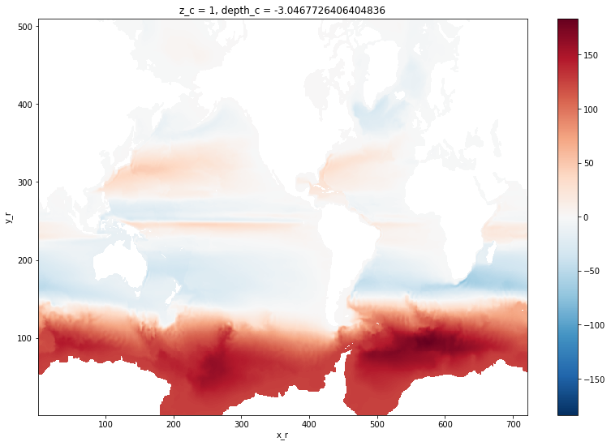

# XORCA

[](https://git.geomar.de/willi-rath/xorca/commits/master)
[](https://git.geomar.de/willi-rath/xorca/commits/master)


## What is this about?

XORCA brings [XGCM](https://xgcm.readthedocs.io) and
[Xarray](https://xarray.pydata.org) to the ORCA grid.  (It actually brings all
this to NEMO output.  But [xnemo was already
taken](https://github.com/serazing/xnemo).)

It allows for opening all output files from a model run into one Xarray dataset
that is understood by XGCM.  With this, grid-aware differentiation and
integration / summation is possible.


### Example: Calculate the barotropic stream function in 2 lines

After a short preamble which imports the package and loads the data:

```python
import xarray as xr
import xgcm
from xorca.lib import preprocess_orca

original_ds = xr.open_mfdataset(list_of_all_model_output_files)
ds = preprocess_orca(path_to_mesh_mask_file, original_ds)
grid = xgcm.Grid(ds, periodic=["Y", "X"])
```

This is all that's needed to define and calculate the barotropic stream
function for all time steps:
```
U_bt = (ds.vozocrtx * ds.e3u).sum("z_c")
psi = grid.cumsum(- U_bt * ds.e2u, "Y") / 1.0e6
```

And this triggers the actual computation and produces the image:
```
psi.mean("t").plot(size=9);
```



### More examples

See the example notebook for hints on where this might end:
[notebooks/calculate_psi_speed_and_amoc.ipynb](notebooks/calculate_psi_speed_and_amoc.ipynb).


## Installation

Install Xarray and its dependencies.

Install XGCM:
```bash
pip install git+https://github.com/xgcm/xgcm.git@master
```

Install XORCA:
```bash
pip install git+https://git.geomar.de/willi-rath/xorca.git@master
```
